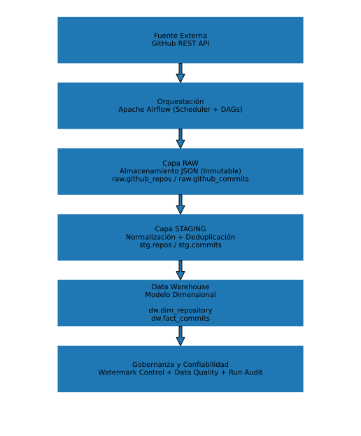

# 🚀 Pipeline ETL Incremental con Airflow -- Arquitectura de Datos en Estilo Productivo

## 📌 Descripción del Proyecto

Este proyecto implementa un **pipeline ETL incremental con enfoque
productivo**, diseñado bajo buenas prácticas de ingeniería de datos,
orientado a entornos empresariales.

El pipeline extrae información desde la API de GitHub, la transforma y
la carga en un modelo dimensional optimizado para análisis,
incorporando:

-   Control de incrementalidad mediante watermark por entidad
-   Cargas idempotentes
-   Detección automática de duplicados
-   Validaciones de calidad de datos (Data Quality Checks)
-   Auditoría y trazabilidad por ejecución
-   Registro automático de fallos y causa raíz

El objetivo del proyecto es simular una arquitectura real utilizada en
entornos corporativos donde la confiabilidad, la observabilidad y la
consistencia de los datos son críticas.

------------------------------------------------------------------------

# 🏗 Arquitectura

## 🔄 Flujo General

    GitHub API
         ↓
    RAW (JSON persistente)
         ↓
    STAGING (normalización + deduplicación)
         ↓
    DATA WAREHOUSE (modelo dimensional)
         ↓
    Data Quality & Auditoría

------------------------------------------------------------------------


## 🗂 Capas de Datos

### 1️⃣ Capa RAW

-   Persistencia completa del payload JSON
-   Ingesta inmutable
-   Permite reprocesamiento sin volver a llamar a la API

Tablas: - `raw.github_repos` - `raw.github_commits`

------------------------------------------------------------------------

### 2️⃣ Capa STAGING

-   Normalización de datos
-   Deduplicación mediante función de ventana (`ROW_NUMBER`)
-   Prevención de errores de cardinalidad en UPSERT

Tablas: - `stg.repos` - `stg.commits`

------------------------------------------------------------------------

### 3️⃣ Data Warehouse (Modelo Dimensional)

Modelo optimizado para análisis:

-   `dw.dim_repository`
-   `dw.fact_commits`

Relación:

    fact_commits.repo_id → dim_repository.repo_id

Este diseño permite análisis por repositorio, volumen de commits y
evolución temporal.

------------------------------------------------------------------------

# 🔁 Estrategia de Incrementalidad

El pipeline implementa una estrategia robusta de carga incremental
basada en:

-   Tabla de control: `dw.etl_watermark`
-   Watermark por entidad (repositorio)
-   Actualización del watermark únicamente después de carga exitosa en
    FACT
-   Protección contra pérdida lógica de datos

------------------------------------------------------------------------

# 🧠 Decisiones Técnicas Clave

### ✅ Cargas Idempotentes

La tabla `stg.commits` utiliza `ON CONFLICT` con clave natural (`sha`),
garantizando:

-   Reprocesamientos seguros
-   Consistencia ante ejecuciones repetidas
-   Eliminación de duplicados multi-batch

------------------------------------------------------------------------

### ✅ Deduplicación con Ventana Analítica

Se utiliza:

``` sql
ROW_NUMBER() OVER (PARTITION BY sha ORDER BY raw_ingested_at DESC)
```

Esto evita errores de tipo:

    ON CONFLICT DO UPDATE command cannot affect row a second time

------------------------------------------------------------------------

### ✅ Actualización Correcta del Watermark

El watermark se actualiza únicamente después de:

    LOAD FACT → UPDATE WATERMARK

Nunca en la fase de extracción.

------------------------------------------------------------------------

# 📊 Data Quality Checks Integrados

El pipeline incluye validaciones automáticas que pueden detener la
ejecución si se detectan inconsistencias:

-   ✔ No existen `repo_id` nulos en FACT
-   ✔ Integridad referencial entre FACT y DIM
-   ✔ Watermark no adelantado respecto a datos reales
-   ✔ Validación de propagación RAW → STG

Si algún check falla:

-   El DAG se marca como FAILED
-   Se registra la causa raíz
-   Se conserva trazabilidad completa

------------------------------------------------------------------------

# 🧾 Auditoría y Observabilidad

Tabla: `dw.etl_run_log`

Cada ejecución registra:

-   Run ID
-   Fecha de inicio y fin
-   Estado (RUNNING / SUCCESS / FAILED)
-   Task responsable del fallo
-   Métricas por capa:
    -   Batches RAW
    -   Registros STG
    -   Registros DIM
    -   Registros FACT

------------------------------------------------------------------------

# 🐳 Ejecución Local

## Requisitos

-   Docker
-   Docker Compose

## Levantar entorno

``` bash
docker compose up -d
```

Acceso Airflow:

    http://localhost:8080

------------------------------------------------------------------------

# 🛠 Stack Tecnológico

-   Python
-   Apache Airflow
-   PostgreSQL
-   Docker
-   GitHub REST API
-   SQL avanzado (CTE, ventanas analíticas, UPSERT)

------------------------------------------------------------------------

# 📈 Posibles Mejoras Futuras

-   Particionamiento de tablas FACT
-   Monitoreo de frescura de datos
-   Alertas automáticas (Slack/Email)
-   Integración CI/CD
-   Optimización incremental por lote procesado
-   Dashboard de monitoreo en Power BI / Metabase

------------------------------------------------------------------------

# 💼 Objetivo Profesional

Este proyecto fue desarrollado como demostración práctica de:

-   Diseño de pipelines incrementales robustos
-   Buenas prácticas de ingeniería de datos
-   Gobernanza y confiabilidad de datos
-   Observabilidad en procesos ETL

------------------------------------------------------------------------

# 👨‍💻 Autor

Dubey Angulo\
Ingeniero de Sistemas\
Colombia 🇨🇴
